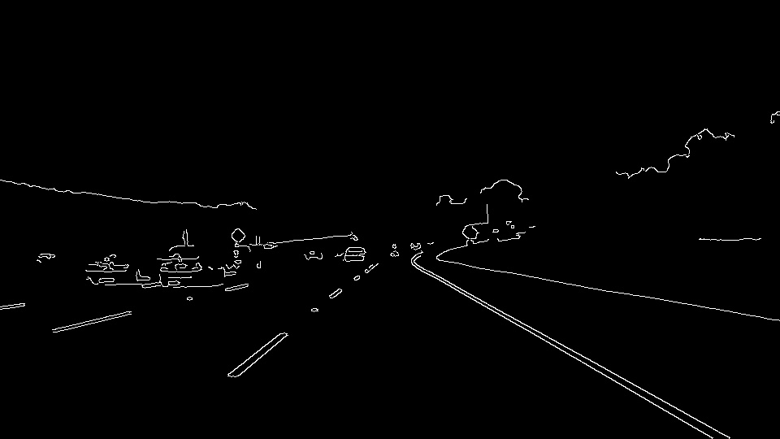
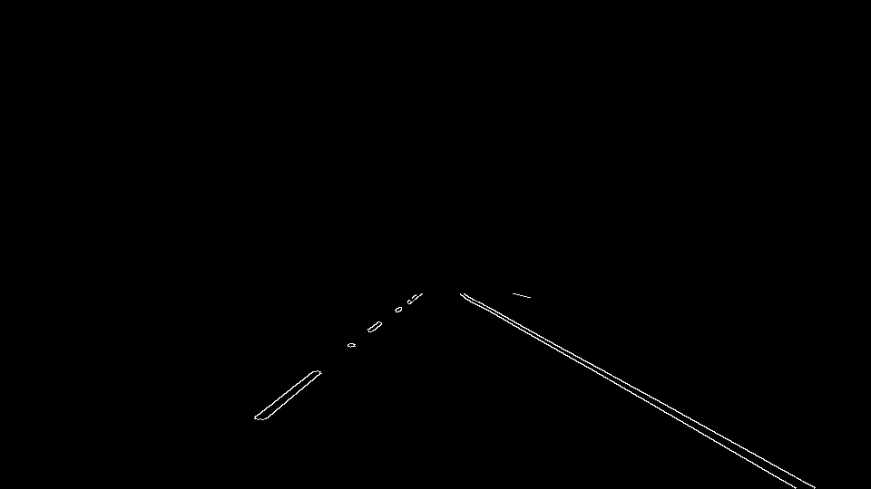
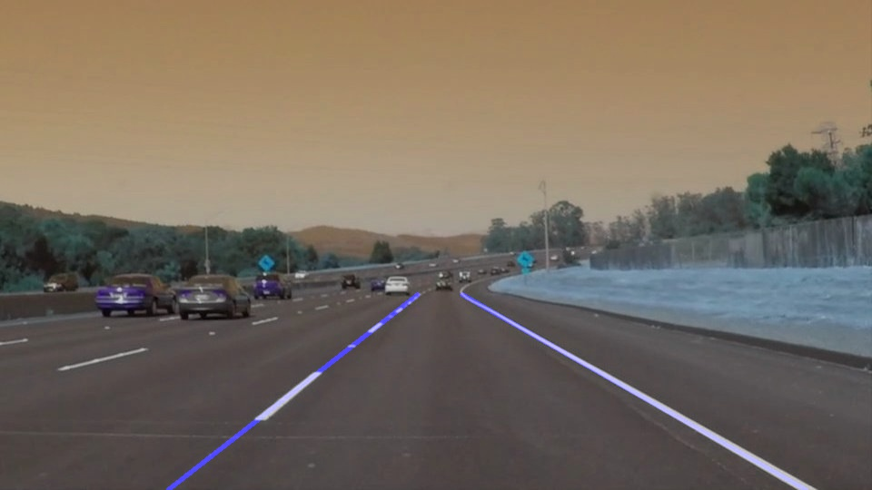

# **Finding Lane Lines on the Road** 

## Project 1 on Self-Driving Car Engineer Nanodegree Program

### This project provides a solution to identify lane lines on the road, first in an image, and later in a video stream.

---

**Finding Lane Lines on the Road**

The goals / steps of this project are the following:
* Make a pipeline that finds lane lines on the road
* Reflect on my work in a written report

 

[//]: # (Image References)

[image_origin]: test_images/solidWhiteCurve.jpg
[image_edges]: test_images_output/solidWhiteCurve_edges.jpg
[image_masked_edges]: test_images_output/solidWhiteCurve_masked_edges.jpg
[image_result]: test_images_output/solidWhiteCurve_result.jpg

---

### Reflection

### 1. Pipeline description

My pipeline function's name is called `line_detect()`, it includes 6 steps, which are described as follows:

- First, the image is converted to grayscale by the helper function `grayscale()` , no parameter tuning in this step.

- Second, a Gaussian Noise kernel `gaussian_blur()` is applied to smooth the returned image of `grayscale()` .

- Third, Canny Edge Detection `canny()` is used to find out the pixels along the lane lines by appropriate set of `low_threshold` and `high_threshold`.

``` Python
low_threshold = 100
high_threshold = 200
edges = canny(blur_gray,low_threshold,high_threshold)
```


- Fourth, we assume the rough position of lane lines and set `vertices` to form the polygon, then we apply an image mask in function `region_of_interest()`.

``` Python
imshape = image.shape
vertices = np.array([[(0,imshape[0]),(int(0.4*imshape[1]),int(0.6*imshape[0])),
                        (int(0.6*imshape[1]),int(0.6*imshape[0])), (imshape[1],imshape[0])]], dtype=np.int32)
masked_edges = region_of_interest(edges,vertices)
```



- Fifth, an image with hough lines drawn is formed by function `hough_lines()`. In addition to the parameter tuning, the key function `draw_lines()` contained in this function is critical to map out the full extent of the left and right lane boundaries. In order to draw a single line on the left and right lanes, the lines from Hough Transform are necessary to be recalculated and optimized by average calculation and some constraints. Here we specify the slop to an appropriate range by `slope_eps_min` and `slope_eps_max`, which means that only the lines meets the specified range are considered to be drawn. 

``` Python
# Range of the lanes' slope
slope_eps_min = 0.5      # set the minimum absolute value of the lanes
slope_eps_max = 5.6      # set the maximum absolute value of the lanes
```

- Since the full lane is more likely to pass through the longer line segment, we apply the length of each line as weight to get the average slope and center. Then the endpoints of left and right lane line in one image can be found by `left_slope_mean`, `left_center_mean`, `right_slope_mean` and `right_center_mean`. 

``` Python
# Left lane is not a straight line nor a parallel line, the slope should be in the range specified
if slope > -slope_eps_max and slope < -slope_eps_min:
# Here apply the length of each line as weight to calculate the average slope and center
    left_slope_mean += slope * length
    left_center_mean[0] += center[0] * length
    left_center_mean[1] += center[1] * length
    left_length_cnt += length
    
# Calculate bottom x and top x assuming fixed positions for corresponding y from current image
left_x_bottom = int((left_y_bottom - left_center_mean[1]) / left_slope_mean + left_center_mean[0])
left_x_top = int((left_y_top - left_center_mean[1]) / left_slope_mean + left_center_mean[0])
```

- However, the performance is not good when this method is used in a video. To surpress the vibration of lane lines in the video, we use the average filtering method to update new positions of lane lines: collect the average positions from previous images(the number of images is fixed in `max_len_rec`) to form a list, then use the list's elements and current image's results to get a new average position, which is a new result to current image. 

``` Python
# To surpress the vibration of lane lines in the video, we use the average filtering method to update new positions of lane lines
if len(left_x_bottom_rec) >= max_len_rec:
    left_x_bottom_rec.pop(0)
    left_x_bottom_rec.append(left_x_bottom)  # Update the list of fixed size
    left_x_bottom = mean_of_list(left_x_bottom_rec, len(left_x_bottom_rec)) # Get a new left bottom x from the recorded results
```

- In addition, if lane line is not drawn for a second, maybe the lane's edge is not detected by Canny algorithm due to the sudden change of environment, here we use the previous image's result as substitute to handle this problem.

``` Python
left_x_bottom = mean_of_list(left_x_bottom_rec, len(left_x_bottom_rec))
left_x_top = mean_of_list(left_x_top_rec, len(left_x_top_rec))
```

- The last step is to use function `weighted_img()`  to make the lines semi-transparent.




### 2. Potential shortcomings with the current pipeline

Since the parameters in each function are set to specific values to handle the detection under a simple circumstance, the solution provided is not applicable to a complex environment(e.g. broken road/curve road/parallel stop line detection).

### 3. Possible improvements to the pipeline

A possible improvement would be to develop a new method which draw curve line in lane line detection.

Another potential improvement could be to explore a new solution to handle edge detection under complex environment, such as an algorithm to calculate certain values of threshold for Canny Edge Detection.
